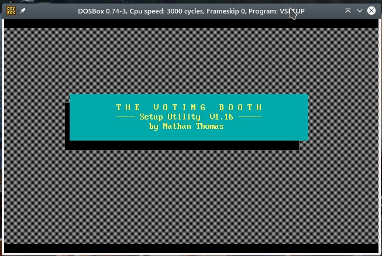
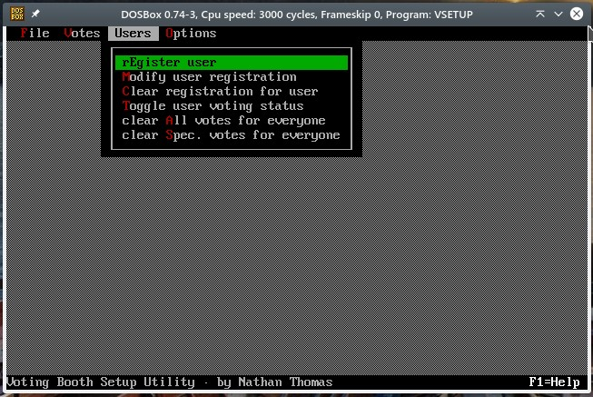
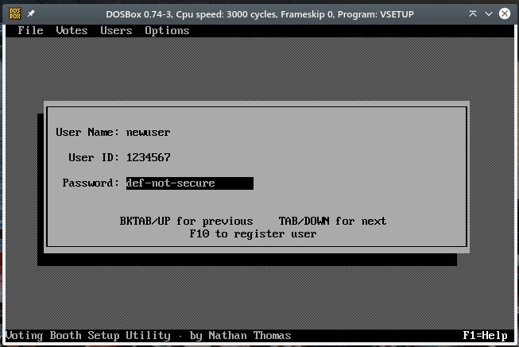
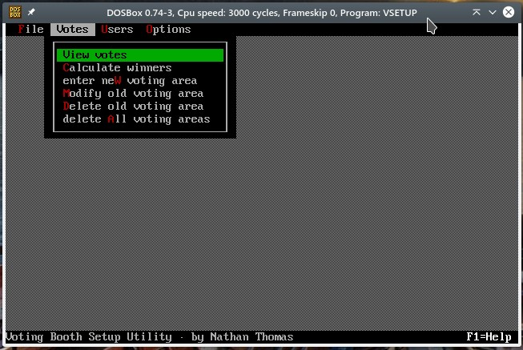
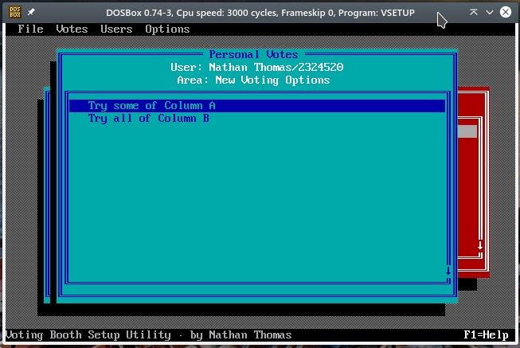
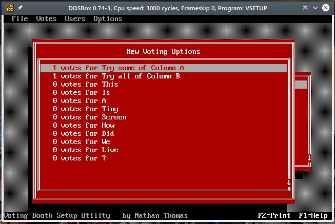
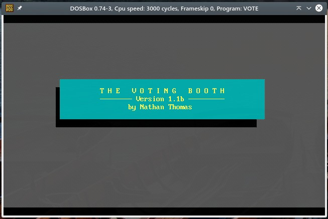
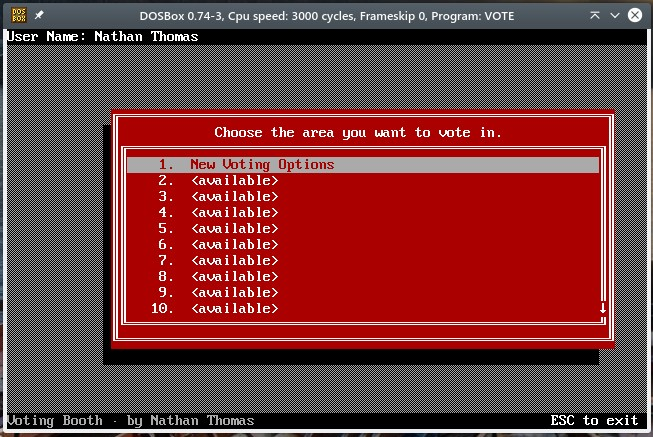
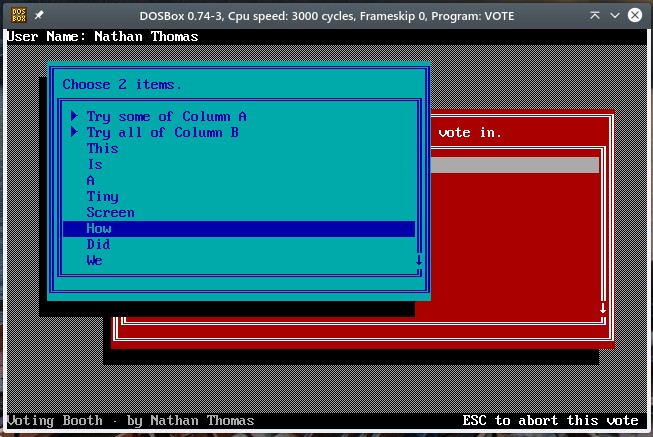

This is a personal software project from around 1994/1995. This was intended to allow "voting" on a school file-based network system at the time. Basically, create a poll and let students log in and place their vote.

There is a set of libraries used that I am unsure if I can post due to totally unknown licensing. I absolutely paid for them so I could use them personally and in my compiled projects, but I cannot include them here alongside my code

As you can see, the header in each file is ... unhelpful

```
{--------------------------------------------------------------------------}
{                         TechnoJock's Turbo Toolkit                       }
{                                                                          }
{                              Version   5.10                              }
{                                                                          }
{                                                                          }
{               Copyright 1986-1993 TechnoJock Software, Inc.              }
{                           All Rights Reserved                            }
{                          Restricted by License                           }
{--------------------------------------------------------------------------}
```

Here's some screens of vote! Running for the first time in about 25 years. Running in [dosbox](https://www.dosbox.com/) because I STILL HAD OLD COMPILED BINARIES!











